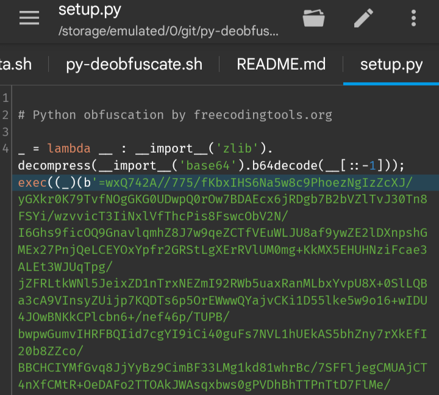

**notes:** I'm not responsible for any short of loss due to this script. it's your fault for choosing this solution for obfuscating your script. have a nice day.

# What is this?

A shell script for deobfuscate obfuscated python script by [freecodingtools.org](https://freecodingtools.org/py-obfuscator). even the website says _'this method makes it difficult for hackers to gain access to your sensitive source code. This Python obfuscator is highly advanced, using multi-layer obfuscation to make it effectively impossible to recover the original source code.'_, a random 15yo just casually cracked this open like it was nothing.

## How this work?
```yaml
1. Replace 'exec' to 'print`
2. Run the script like usual but append to temp file
3. Grep encrypted script chunk from temp file
4. Compiles the decryption script with the script chunk
5. Loop from step 2 until there's no string 'exec' on temp file
```

## Installation and Usage
```shell
# Install dependencies
apt update -y && apt upgrade -y
apt install python2 && apt install python3

# Deobfuscate
bash py-deobfuscate.sh example.py
python3 py-deobfuscate example.py
```

## Oh no, i used this web for obfs my secret script 😭
**You're done, anyone now can see what's actually inside your script, have a nice day 🧋**
